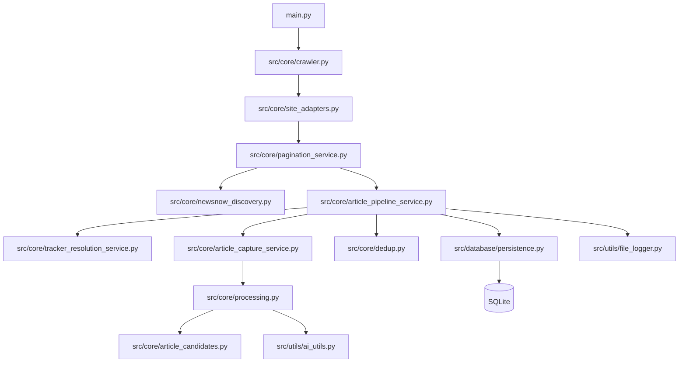

# AI Web Crawler Architecture Document

## 1. System Overview

The crawler is a local Python command-line application that discovers NewsNow article batches, resolves tracker URLs, extracts final publisher content, deduplicates results, and persists crawl artifacts into SQLite.

The current architecture is a **modular monolith** with **site adapters** and **strategy boundaries**:

- one deployable/runtime process
- clear separation between orchestration, discovery, extraction, dedup, and persistence
- NewsNow-specific behavior isolated behind a dedicated adapter instead of spread across the generic crawl loop

This is the right trade-off for the current project size:

- simpler than microservices
- easier to debug locally
- still structured enough to support future site adapters

## 2. Architectural Style

### Chosen approach

- **Modular monolith**
- **Layered flow with service modules**
- **Strategy-oriented boundaries for site-specific behavior**

### Why this approach

- the system is still a single crawler runtime and does not need distributed deployment complexity
- NewsNow requires site-specific discovery and tracker resolution, but the rest of the pipeline is reusable
- the code now has a clearer split between:
  - orchestration
  - pagination/discovery strategy
  - article processing pipeline
  - tracker resolution
  - extraction
  - dedup
  - persistence

### Why not microservices yet

- no strong need for independent deployment
- no clear multi-team ownership boundary
- much higher operational cost than the current problem warrants

## 3. High-Level Flow



## 4. Module Responsibilities

### Entrypoint and orchestration

- [src/main.py](/abs/path/c:/Users/Hi/Desktop/MyProject/CrawWeb/src/main.py)
  - load config
  - initialize DB
  - launch crawl

- [src/core/crawler.py](/abs/path/c:/Users/Hi/Desktop/MyProject/CrawWeb/src/core/crawler.py)
  - normalize start URL
  - create crawler runtime
  - select site adapter
  - delegate execution to pagination strategy
  - emit run-level summary
  - retry previously failed items

- [src/core/site_adapters.py](/abs/path/c:/Users/Hi/Desktop/MyProject/CrawWeb/src/core/site_adapters.py)
  - select adapter by site/domain
  - bind a concrete pagination strategy to the current crawl

### Pagination and discovery

- [src/core/pagination_service.py](/abs/path/c:/Users/Hi/Desktop/MyProject/CrawWeb/src/core/pagination_service.py)
  - `GenericUIPaginationStrategy`
  - `NewsNowPaginationStrategy`
  - stop conditions
  - in-memory tracker URL state across pagination loops
  - seeded UI fallback to avoid recrawling already-processed NewsNow items
  - fallback from backend discovery to UI pagination

- [src/core/newsnow_discovery.py](/abs/path/c:/Users/Hi/Desktop/MyProject/CrawWeb/src/core/newsnow_discovery.py)
  - parse NewsNow page context
  - build backend discovery payload
  - fetch `POST /h/app/v1/articles`
  - parse backend batch responses into `DiscoveredArticle`

### Tracker resolution and article pipeline

- [src/core/tracker_resolution_service.py](/abs/path/c:/Users/Hi/Desktop/MyProject/CrawWeb/src/core/tracker_resolution_service.py)
  - resolve NewsNow tracker URLs
  - prefer HTML parsing
  - fallback to browser navigation only if needed

- [src/core/article_pipeline_service.py](/abs/path/c:/Users/Hi/Desktop/MyProject/CrawWeb/src/core/article_pipeline_service.py)
  - process discovered article batches
  - apply discovery and tracker metadata
  - exact dedup checks
  - semantic dedup classification
  - persistence

- [src/core/article_capture_service.py](/abs/path/c:/Users/Hi/Desktop/MyProject/CrawWeb/src/core/article_capture_service.py)
  - navigate final publisher page
  - hand off final HTML to extraction pipeline

### Extraction and content analysis

- [src/core/processing.py](/abs/path/c:/Users/Hi/Desktop/MyProject/CrawWeb/src/core/processing.py)
  - candidate ranking
  - rule-based extraction
  - AI fallback
  - extraction validation
  - final-article metadata enrichment

- [src/core/article_candidates.py](/abs/path/c:/Users/Hi/Desktop/MyProject/CrawWeb/src/core/article_candidates.py)
  - candidate discovery
  - candidate scoring
  - candidate cleaning

- [src/utils/ai_utils.py](/abs/path/c:/Users/Hi/Desktop/MyProject/CrawWeb/src/utils/ai_utils.py)
  - LLM extraction strategy
  - parse AI output into extraction DTOs

### Dedup and runtime utilities

- [src/core/dedup.py](/abs/path/c:/Users/Hi/Desktop/MyProject/CrawWeb/src/core/dedup.py)
  - semantic duplicate classification
  - `exact_duplicate`, `near_duplicate`, `same_story`, `unique`
  - optional embedding-assisted similarity checks

- [src/core/embeddings.py](/abs/path/c:/Users/Hi/Desktop/MyProject/CrawWeb/src/core/embeddings.py)
  - deterministic hashing-based embedding baseline
  - cosine similarity for lightweight semantic comparison

- [src/core/retry.py](/abs/path/c:/Users/Hi/Desktop/MyProject/CrawWeb/src/core/retry.py)
  - shared async retry helper

- [src/core/runtime_models.py](/abs/path/c:/Users/Hi/Desktop/MyProject/CrawWeb/src/core/runtime_models.py)
  - run-level and batch-level stats models

- [src/core/metrics.py](/abs/path/c:/Users/Hi/Desktop/MyProject/CrawWeb/src/core/metrics.py)
  - summarize crawl events into regression-friendly metrics
  - convert structured logs into throughput and quality indicators

- [src/core/evaluation_set.py](/abs/path/c:/Users/Hi/Desktop/MyProject/CrawWeb/src/core/evaluation_set.py)
  - derive evaluation cases from structured crawl events
  - bridge local fixtures and observed production-like samples

- [src/core/strategy.py](/abs/path/c:/Users/Hi/Desktop/MyProject/CrawWeb/src/core/strategy.py)
  - protocol-style boundaries for:
    - `DiscoveryStrategy`
    - `PaginationStrategy`
    - `LinkResolutionStrategy`
    - `ContentExtractionStrategy`
    - `DedupStrategy`
    - `ArticleBatchProcessor`

### Persistence

- [src/database/models.py](/abs/path/c:/Users/Hi/Desktop/MyProject/CrawWeb/src/database/models.py)
  - persistence-facing article model
  - error log model

- [src/database/persistence.py](/abs/path/c:/Users/Hi/Desktop/MyProject/CrawWeb/src/database/persistence.py)
  - schema definition
  - schema evolution for SQLite
  - exact dedup lookups
  - error log storage
  - failed item lookup for targeted retry

## 5. Data Model Overview

### Discovery-stage model

`DiscoveredArticle` contains:

- `list_page_url`
- `tracker_url`
- `grid_title`
- `grid_source`
- `grid_time_text`
- `grid_position`
- `tracker_article_id`
- `timestamp`

### Tracker-resolution model

`TrackerResolutionResult` contains:

- `tracker_url`
- `final_url`
- `tracker_article_id`
- `redirect_delay_ms`
- `manual_redirect`
- `tracker_og_title`
- `tracker_og_image`
- `used_browser_fallback`

### Persisted article model

`ScrapedData` now contains:

- discovery metadata
- tracker metadata
- final article metadata
- exact dedup keys
- semantic dedup fields
- extracted `main_content`

This lets a saved record be traced end-to-end:

- NewsNow list item
- tracker resolution
- final publisher page
- extraction result
- dedup decision

## 6. Dependency Direction

The intended dependency direction is:

- `crawler.py` -> site adapter -> pagination strategy
- pagination service -> discovery and article pipeline services
- article pipeline -> resolution/capture/dedup/persistence
- capture -> processing
- processing -> AI utils / HTML utils / candidate scoring
- persistence and models stay at the bottom

Rules:

- high-level orchestration should not know extraction internals
- NewsNow parsing should not know DB details
- persistence should not depend on crawl orchestration

## 7. Current Directory Structure

```txt
src/
  main.py
  core/
    article_candidates.py
    article_capture_service.py
    article_pipeline_service.py
    crawler.py
    dedup.py
    embeddings.py
    evaluation_set.py
    errors.py
    extractor.py
    metrics.py
    navigation.py
    newsnow.py
    newsnow_discovery.py
    pagination_service.py
    processing.py
    retry.py
    runtime_models.py
    site_adapters.py
    strategy.py
  database/
    models.py
    persistence.py
  utils/
    ai_utils.py
    browser_utils.py
    config_loader.py
    content_utils.py
    datetime_util.py
    file_logger.py
    html_utils.py
```

## 8. Why This Refactor

Before refactor:

- `src/core/crawler.py` contained too much:
  - runtime setup
  - pagination
  - NewsNow-specific logic
  - tracker resolution
  - final page capture
  - dedup and save policy
  - retry behavior

After refactor:

- `crawler.py` is orchestration-focused
- adapter selection moved into `site_adapters.py`
- site-specific pagination logic moved to concrete strategy classes in `pagination_service.py`
- article processing logic moved to `article_pipeline_service.py`
- tracker resolution and final-page capture have dedicated services
- pagination now preserves seen-link state across loops instead of reprocessing the full visible DOM each time

This improves:

- readability
- maintainability
- testability
- future site-adapter migration

## 9. Remaining Gaps

The architecture is now better aligned, but not fully finished.

Still open:

- sample-based evaluation set with real multi-domain fixtures
- real benchmark baselines from multiple live crawl runs

Partially complete:

- strategy protocols now exist
- adapter selection now exists
- not every lower-level service is injected through interfaces yet

## 10. Recommendation

Keep the system as a modular monolith for now.

Next architecture step should be:

1. wire lower-level services through strategy interfaces where extension pressure is real
2. build evaluation fixtures before making semantic dedup more complex
3. only then add more site adapters if the product scope expands

This preserves a practical path from current code to a cleaner reusable crawler platform without premature complexity.
